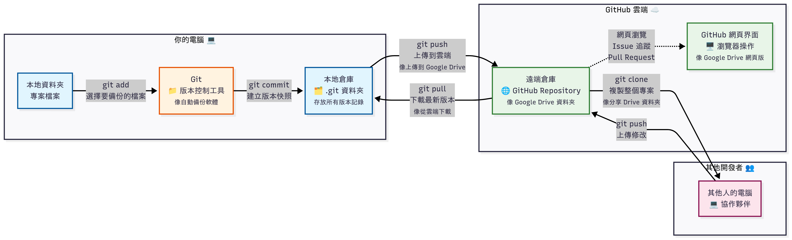

# Git

- quick note: 只要是 `<>` 裡面的文字連同 `<>` 本身都可以隨意切換

## 簡介 Git 的工作方式



- 一個由 .git 檔案進行版本控制的資料夾，會稱為一個倉庫（repository, or repo）
- 這個倉庫可以只純在本機，或是上傳到 Github 並且兩者同步更新，可以將 Github 理解成雲端硬碟的角色

### 對於一個倉庫，你可以

- 透過 `git checkout -b <branch_name>` 在新的分支上工作
- 透過 `git diff` 對檔案編輯的狀態進行查看
- 透過 `git add <file_name>` 決定要在這個版本加入哪些變更
- 透過 `git commit -m "<anything to add on>"` 將快照加入現有的分支中，並且加上註解

### 要將本機的倉庫和雲端同步，你可以

- 透過 `git pull` 將最新的雲端倉庫下載
- 透過 `git checkout -b <my-feature>`，在新的分支上編輯檔案
- 透過 `git merge main` 或是 `git rebase main`，將現有分支的內容合併到主要分支（main branch）上

## 使用範例

在實際使用上，你有可能（一）從Github下載別人已經寫好的程式；或是（二）創建一個新的倉庫。

### 從 Github 下載已經寫好的程式

- 打開終端機，進入你希望資料儲存的位置（上層資料夾名稱盡量不要有中文、空格），輸入：

```sh
git clone https://github.com/hungchunchang/SocialRoboticsProgram.git
```

- [text](https://excalidraw.com/#json=VCCuDY6fH9WRAVcIeNseY,1zcF3f7EU8FSrPUg7jKcWA)

- 新增一個 branch

```sh
git checkout -b <my-feature>
```

- 在這邊進行更改，並不會影響到 main branch 上的檔案。在完成開發後：
- 情境一：將檔案推送到原本的倉庫中：

```sh
git push origin <my-feature>
```

在 github 上建立 pull request，會由負責人進行審查，再決定是否要合併你提交的更新。

- 情境二：合併其他人更新的新內容
  - 首先切換回 main branch
  - 將新的進度拉取下來

```sh
git checkout main
git pull origin main
```

如果你這個 feature 分支的任務還沒結束，或者你想基於最新的 main 繼續寫，這時就要進行 Rebase：

```Bash
git checkout <my-feature>
git rebase main

這會把你在 feature 分支上尚未合併（或新寫）的 commit，重新接在剛才拉下來的最新 main 之後。

### 創建一個新的倉庫

```sh
git init
```

## 參考影片

- [觀念影片，可以多看幾次](https://www.youtube.com/watch?v=uj8hjLyEBmU)
- [papya](https://www.youtube.com/watch?v=FKXRiAiQFiY)
- [桌面版教學](https://www.youtube.com/watch?v=Jzlbr4izdpc&list=PL2SrkGHjnWcyTc7LzJwXKAxTH1LlNfoZU)