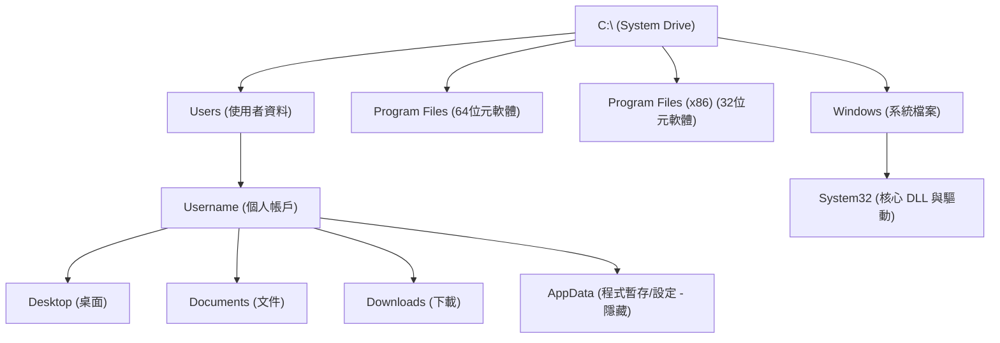
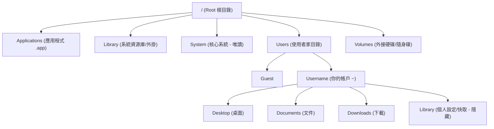

# 操作終端機

## TUI vs. GUI

文字使用者介面（text user interface）與圖形使用者介面（graphic user interface）是兩種現在主流的使用者介面。最直觀的對比，就是透過檔案/Finder（GUI），以及終端機（TUI）查看文件。

文字使用者介面不僅大量被軟體開發者使用，在 AI 崛起的時代，想要更進階的使用 AI、將大語言模型整合進自己的工作流程，使用命令列工具 (command line tool, cli) 會更加方便容易，例如 Anthropic 的 Claude Code, OpenAI 的 CodeX 或是 Google 的 Gemini 都提供了 cli 也就是文字使用者介面，讓 AI 能夠直接在你的終端機操作你的電腦。

最早的 TUI 是 cli ，在cli中，使用者只能透過文字輸入指令，並且獲得一對一的回應，例如在終端機輸入：

```sh
cd ~
```

就會回到根目錄。
而 TUI 則是透過文字方塊、色塊等元件讓文字介面如圖形界面一般的視覺體驗，例如下面的動畫就是TUI的一種應用：

<iframe src="https://ghostty.org/" height=400></iframe>

總之，相較於 GUI 充斥著按鈕、隱藏的流程，TUI/Cli 下的工作介面更扁平、需要使用者記憶更多的命令，但同時更穩健，也更適合像 LLM 這樣擅長輸出語言，而非操作圖形化介面的人工智慧模型操作。

### 檔案結構

在活用 cli 之前，必須先了解電腦的檔案結構與 cli 的指令。在不同的作業系統中，會預設不同的檔案儲存方式，也就是我們在檔案/Finder中看到的資料夾。每一個資料夾下可以儲存各式各樣的檔案和資料夾（廢話），下面兩張圖分別是 Windows 和 MasOS 兩種作業系統預設的資料夾結構：



圖：Windows 的檔案系統

範例：

```sh
cd C:\Users\Username\Documents\
```



```sh
cd ~/Users/Username/Documents
```

圖：MacOS 的檔案系統

總之，這兩個檔案系統儲存檔案的方式各有不同，而我們使用者也可以自由的在不同目錄下創建資料夾，而對於 cli 的使用者來說，了解自己的檔案系統至關重要！

## cli的基礎操作

當我們打開終端機時，可能會看到這個畫面：

```sh
~ > 

# for macOS, or

C:\ > 
# for windows
```

（終端機可能因爲使用不同的模擬器，所以畫面長得很不一樣，在 macOS/linux 上可以自己選擇不同的模擬器如 ghostty, iterm2等，有興趣的話可以參考[這個](https://lijianfei.com/post/gao-bie-iterm2-de-yin-ying-ghostty-zhe-kuan-shen-ji-zhong-duan-mo-ni-qi-jiang-dian-fu-ni-de-ren-zhi/)[或這個](https://www.reddit.com/r/Ghostty/comments/1hw1jc2/my_ghostty_config/?tl=zh-hant)進行設定）

### ls/dir

其中 `~`代表你在根目錄之下，如果你想要進入下一層檔案（可以參照上面的圖），可以輸入 `ls` 或`dir` 來查找根目錄底儲存的檔案：

```sh
ls # 

# short for list, used in macOS, or

dir
# short for directory, used in windows
```

範例：如果你在 ~ (家目錄)，輸入 ls 後，你可能會看到 Desktop, Documents, Downloads 等資料夾。

### cd: change directory

> cd：移動你的位置cd 代表 change directory，是用來切換目前所在資料夾的指令。

- 進入下一層： `cd <資料夾名稱>`
- 回上一層： `cd ..` (兩個點代表「上一層」)
- 直接回家： `cd ~` (這會帶你回到目前使用者的個人帳戶根目錄)

操作練習：根據上面的結構圖，如果你在 ~ 想進入桌面，請輸入：cd Desktop

### mkdir：建立新資料夾

當你想在目前的目錄下生出一個新的資料夾時，使用 mkdir (make kildirectory)。用法：

- `mkdir <新資料夾名稱>`
- `nano test.py`: 這是一個文字編輯器
  - ctrl + o: 寫入
  - enter 確認存檔位置
  - ctrl + x: 離開編輯器
- `cat test.py`: concatenate

操作練習：如果你想在 Documents 裡建立一個名為 Project 的資料夾：cd Documents (先進入文件)mkdir Project (建立資料夾)

### rm (macOS/Linux) 或 del / rmdir (Windows)：刪除檔案或資料夾

> 注意：CLI 的刪除通常是不會進回收桶的，刪了就直接消失，請務必小心使用！

- 刪除檔案： `rm <檔案名稱>`
- 刪除整個資料夾： `rm -r <資料夾名稱>` ( -r 代表 recursive，會連同裡面的東西一起刪除)
- 警告：千萬不要在根目錄隨便輸入 rm -rf /，這會強制刪除你整台電腦的所有系統檔案！

### 指令小結表

|功能|macOS / Linux|Windows (PowerShell/CMD)|
|-|-|-|
|列出清單|ls|dir(PowerShell 也支援 ls)|
|切換目錄|cd|cd|
|建立資料夾|mkdir|mkdir|
|刪除檔案|rm|del|
|刪除資料夾|rm -r|rmdir /s|

> 💡 小技巧：善用 Tab 鍵在 CLI 裡，你不需要手打完整的資料夾名稱。當你輸入 cd Des 然後按下鍵盤上的 Tab 鍵，系統會自動幫你補完 Desktop。這不只省力，還能確保你沒有打錯字！

## 絕對與相對路徑

在掌握了基礎指令後，你一定會遇到一個問題：「我要怎麼告訴電腦，檔案到底在哪裡？」*- 這就像是在地圖上標示位置，你可以說「從這裡往北走 100 公尺」（相對位置），也可以說「台北市忠孝東路一段 1 號」（絕對位置）。在檔案系統中，這就是絕對路徑與相對路徑。

---

### 1. 絕對路徑 (Absolute Path)

絕對路徑是指從根目錄開始的完整路徑。無論你目前人在哪個資料夾，絕對路徑永遠指向同一個地方，不會因為你移動位置而失效。

- Windows： 以磁碟機代號開頭，例如 `C:\Users\Username\Desktop\cat.jpg`
- macOS / Linux：以根目錄 `/` 開頭，例如 `/Users/Username/Desktop/cat.jpg`

> 特點：*- 像「身分證字號」，具有唯一性，精準但通常很長。

---

### 2. 相對路徑 (Relative Path)

相對路徑是指從你目前所在位置 (Current Working Directory)*- 出發的路徑。它會隨著你目前「人在哪裡」而改變路徑的意義。
用github演示

為了描述相對關係，你需要認識兩個特殊的符號：

- `.` (一個點)：代表目前這層資料夾。
- `..` (兩個點)：代表上一層資料夾。

> 範例：
> 如果你人在 `/Users/Username/Documents` 裡：

- 要進入目錄下的 `Project` 資料夾，路徑就是 `./Project` (或直接寫 `Project`)。
- 要跳出到桌面（假設桌面跟文件同級），路徑就是 `../Desktop`。

---

### 3. 兩者對比表

| 特性 | 絕對路徑 | 相對路徑 |
| :--- | :--- | :--- |
| 開頭方式 | `C:\` 或 `/` (從頭開始) | 資料夾名稱、`.` 或 `..` |
| 穩定性 | 極高，在哪執行都一樣 | 較低，取決於你現在在哪 |
| 常用場景 | 設定檔、系統路徑、程式調用 | 開發專案內部檔案、快速切換鄰近目錄 |
| 直觀程度 | 一眼看出完整位置 | 較短，適合手打指令 |

---

### 💡 開發者的日常建議

- 在終端機操作時：*- 多用 相對路徑。配合 Tab 鍵補完，移動起來最快。
- 在寫程式碼（如 Python/HTML）時：*- - 引用專案內的圖片或模組，用 相對路徑（這樣別人下載你的專案才能執行）。
  - 如果需要讀取電腦系統裡的特定檔案，才考慮使用 絕對路徑。

想像你在 `Users` 資料夾下，要去拿 `Desktop` 裡的檔案。用絕對路徑就像是繞地球一圈回到原點，而相對路徑就是「轉身去隔壁房間」而已。