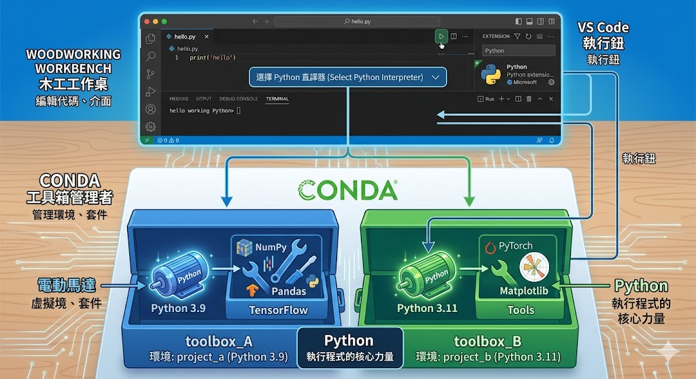

# 00 - 環境建置與工具介紹

- 安裝 VSCode 開發環境與 Python 套件
- 安裝 Conda(miniforge) 依賴管理



1. Conda：環境的管理者（最底層的基礎設施）
Conda 的主要任務是建立「虛擬環境」。

你可以建立一個環境叫 Project_A，裡面裝 Python 3.9。

再建立一個 Project_B，裡面裝 Python 3.11。

這兩者互不干擾，這就是 Conda 的強項：隔離性。

2. Python：執行者
Python 存在於 Conda 的環境之中。當你「啟動 (Activate)」某個 Conda 環境時，你其實是在告訴系統：「現在請使用這一個版本的 Python 來跑我的程式碼」。

3. VS Code：編輯與連接器
VS Code 位於最上層。它本身不知道你的程式碼該怎麼跑，所以它需要透過 Python 擴充套件 去「指向」Conda 裡面的某個環境。

你在 VS Code 右下角選擇 Interpreter (直譯器) 時，就是在挑選要用 Conda 裡的哪一個工具箱。

## VSCode

這是你編輯程式的地方，又稱作 IDE(integrative development environment)，常見的 IDE 有 Android Studio, Pycharm, Cursor, Antigravity等。

### [實作] 下載並安裝

#### 在 Windows 上安裝 VSCode

1. 前往 [code.visualstudio.com](https://code.visualstudio.com)
2. 下載 Windows 版本
3. 執行 `.exe` 檔案，依照指示安裝

#### 在 macOS 上安裝 VSCode

1. 前往 [code.visualstudio.com](https://code.visualstudio.com)
2. 下載 macOS 版本
3. 開啟 `.dmg` 檔案，將 VSCode 拖拉到 Applications 資料夾

### [實作] VSCode 擴充套件安裝

開啟 VSCode 後，按 `Ctrl+Shift+X`（Windows）或 `Cmd+Shift+X`（macOS）開啟擴充套件面板：

1. **Python**：搜尋並安裝 "Python"（Microsoft 官方版）
2. **Jupyter**：搜尋並安裝 "Jupyter"（Microsoft 官方版）

### [概念] Conda 的「環境」概念

conda 是環境管理工具的一種，常見的管理工具還包含了 uv, pyenv 等。除了管理 Python的版本之外，也管理依賴（dependencies）的版本。

這些依賴或資源庫，可以幫助程式開發者減少開發的成本，例如想要做網站，可以透過 `fast-api`，想要呼叫 AI 可以透過 `openai`，這些資源庫提供簡單的介面讓程式開發者可以輕鬆使用這些功能。

而不同的專案可能需要不同版本的套件，而不同版本的套件可能會相互衝突，因此如果全部裝在同一個環境之下，可能出現問題！

### [實作] 安裝 Conda

#### 在 Windows 上安裝

1. 前往 [conda-forge.org/download](https://conda-forge.org/download/)
2. 選擇 Miniconda Installers，下載 Windows 版
3. 執行安裝檔，**勾選 "Add to PATH"**
4. 重新啟動終端機
5. 再次開啟時，使用 Miniforge Prompt

#### 在 macOS 上安裝

1. 前往 [conda-forge.org/download](https://conda-forge.org/download/)
2. 選擇 Miniconda Installers，下載 macOS 版（.sh檔案）
3. 在終端機（terminal）中打開該檔案夾（e.g. 在終端機中輸入 cd Downloads/my_files，會進入名為 my_files 的資料夾）
4. 輸入這段指令 `bash Miniforge3-$(uname)-$(uname -m).sh`，就會開始安裝
5. 當第一次出現一大串文字，按 enter or down arror, 直到他問 yes|no, 輸入 yes
6. 接著一路按 enter, 直到他再次問你 yes|no, 輸入 yes

### [實作] 驗證安裝

開啟終端機（MacOS: Terminal, windows: 命令提示字元/ miniforge terminal），執行：

```bash
conda --version
python --version
```

如果顯示版本號碼就代表安裝成功。

### [實作] 建立 Conda 環境

```bash
conda create -n socialrobot python=3.13
conda activate socialrobot
```

說明：

- `conda create -n socialrobot` = 建立一個叫 `socialrobot` 的環境，你也可以取任何你想要的名稱
- `conda activate socialrobot` = 啟用這個環境
- 之後安裝的所有套件都只存在這個環境中。

## 常見問題

### Windows 使用者

- `conda` 指令無法執行？
  → 重新安裝時勾選 **"Add to PATH"**
- 建議使用 **Git Bash** 作為終端機

### macOS 使用者

- Terminal 找不到 `conda`？
  → 執行：

```bash
echo 'export PATH="~/anaconda3/bin:$PATH"' >> ~/.zshrc
source ~/.zshrc
```

---
